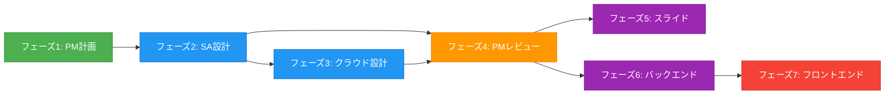

# プロジェクト計画書 — CSCV2025 セキュリティ評価・改善プロジェクト

## 1. プロジェクト概要

### 1.1 背景

本プロジェクトは、CSCV2025 コンテスト対象の2層アプリケーションアーキテクチャに対するセキュリティ評価、脆弱性分析、および改善提案を目的としています。既存コードベース（Django REST API ゲートウェイ + PHP ファイルストレージサービス）を「現状」として扱い、セキュリティ強化とデモンストレーションシステムを構築します。

### 1.2 対象システム

| コンポーネント | テクノロジー | 役割 |
|---------------|-------------|------|
| app1 | Python 3.12 / Django 5.2.6 / DRF / JWT / uWSGI | REST API ゲートウェイ、認証、ファイル検証 |
| app2 | PHP / Apache / 7zip | ファイルストレージ、7zipアーカイブ展開 |
| docker-compose | Docker | コンテナオーケストレーション |

### 1.3 プロジェクト目標

| 目標 | 説明 |
|------|------|
| A. 詳細設計ドキュメント | FPT Softwareの分析・設計能力を証明するビッド資料 |
| B. デモ / クイックウィン | 実行能力を証明し、クライアントに最終製品の可視化を提供 |
| C. 言語 | すべてのドキュメントとデモUIを日本語で作成 |

### 1.4 成功基準

- RFP要件に完全に対応した日本語提案書の作成
- セキュリティ脆弱性の包括的な分析と改善策の提示
- 稼働するデモシステムの構築（バックエンド + フロントエンド）
- クラウドインフラ設計の提示
- プロフェッショナルなプレゼンテーションスライドの作成

---

## 2. Work Breakdown Structure (WBS)

### 1. 計画・プロトコル（ステップ1: PM）
#### 1.1 プロジェクト計画書の作成 — Est: 1日 — Owner: PM
#### 1.2 ワーキングプロトコルの定義 — Est: 0.5日 — Owner: PM
#### 1.3 出力テンプレートの定義 — Est: 0.5日 — Owner: PM

### 2. システムアーキテクチャ設計（ステップ2: SA）
#### 2.1 要件分析 — Est: 2日 — Owner: SA
##### 2.1.1 機能的要件の抽出 — Est: 1日 — Owner: SA
##### 2.1.2 非機能的要件の抽出（セキュリティ、パフォーマンス） — Est: 0.5日 — Owner: SA
##### 2.1.3 ユースケース定義 — Est: 0.5日 — Owner: SA
#### 2.2 システムアーキテクチャ設計 — Est: 2日 — Owner: SA
##### 2.2.1 全体アーキテクチャ図（Mermaid） — Est: 0.5日 — Owner: SA
##### 2.2.2 コンポーネント設計 — Est: 1日 — Owner: SA
##### 2.2.3 API契約定義 — Est: 0.5日 — Owner: SA
#### 2.3 セキュリティ分析 — Est: 2日 — Owner: SA
##### 2.3.1 脆弱性インベントリ — Est: 1日 — Owner: SA
##### 2.3.2 セキュリティ対策設計 — Est: 1日 — Owner: SA
#### 2.4 データモデル設計 — Est: 1日 — Owner: SA
#### 2.5 ユーザストーリー — Est: 1日 — Owner: SA

### 3. クラウドインフラ設計（ステップ3: Cloud Expert）
#### 3.1 クラウドアーキテクチャ設計 — Est: 2日 — Owner: Cloud Expert
##### 3.1.1 インフラストラクチャ図（Mermaid） — Est: 0.5日 — Owner: Cloud Expert
##### 3.1.2 ネットワーク設計 — Est: 0.5日 — Owner: Cloud Expert
##### 3.1.3 セキュリティグループ・ファイアウォール設計 — Est: 0.5日 — Owner: Cloud Expert
#### 3.2 スケーラビリティ・耐障害性設計 — Est: 1日 — Owner: Cloud Expert
#### 3.3 コスト見積もり — Est: 0.5日 — Owner: Cloud Expert
#### 3.4 CI/CD パイプライン設計 — Est: 0.5日 — Owner: Cloud Expert

### 4. PMレビュー・提案書作成（ステップ4: PM）
#### 4.1 ドキュメント統合レビュー — Est: 1日 — Owner: PM
#### 4.2 日本語提案書作成 — Est: 2日 — Owner: PM
##### 4.2.1 エグゼクティブサマリー — Est: 0.5日 — Owner: PM
##### 4.2.2 業務範囲 — Est: 0.5日 — Owner: PM
##### 4.2.3 アプローチ・方法論 — Est: 0.5日 — Owner: PM
##### 4.2.4 タイムライン・チーム構成 — Est: 0.5日 — Owner: PM
#### 4.3 デモシナリオ定義 — Est: 1日 — Owner: PM
##### 4.3.1 デモフロー — Est: 0.5日 — Owner: PM
##### 4.3.2 ワウモーメント設計 — Est: 0.5日 — Owner: PM
#### 4.4 サンプルデータ定義 — Est: 0.5日 — Owner: PM

### 5. スライド作成（ステップ5: Slide Craft）
#### 5.1 プレゼンテーション構成 — Est: 1日 — Owner: Slide Craft
#### 5.2 スライドデザイン・作成 — Est: 2日 — Owner: Slide Craft
#### 5.3 レビュー・修正 — Est: 0.5日 — Owner: Slide Craft

### 6. バックエンドデモ構築（ステップ6: Backend Engineer）
#### 6.1 API実装 — Est: 3日 — Owner: Backend Engineer
##### 6.1.1 認証API — Est: 0.5日 — Owner: Backend Engineer
##### 6.1.2 ファイルアップロードAPI（セキュア） — Est: 1日 — Owner: Backend Engineer
##### 6.1.3 セキュリティ監視API — Est: 1日 — Owner: Backend Engineer
##### 6.1.4 ヘルスチェックAPI — Est: 0.5日 — Owner: Backend Engineer
#### 6.2 データベース設定 — Est: 0.5日 — Owner: Backend Engineer
#### 6.3 テスト — Est: 1日 — Owner: Backend Engineer

### 7. フロントエンドデモ構築（ステップ7: Frontend Engineer）
#### 7.1 UIデザイン・プロトタイプ — Est: 1日 — Owner: Frontend Engineer
#### 7.2 コンポーネント実装 — Est: 2日 — Owner: Frontend Engineer
##### 7.2.1 認証画面 — Est: 0.5日 — Owner: Frontend Engineer
##### 7.2.2 ダッシュボード — Est: 0.5日 — Owner: Frontend Engineer
##### 7.2.3 ファイル管理画面 — Est: 0.5日 — Owner: Frontend Engineer
##### 7.2.4 セキュリティダッシュボード — Est: 0.5日 — Owner: Frontend Engineer
#### 7.3 API連携 — Est: 1日 — Owner: Frontend Engineer
#### 7.4 ポリッシュ・テスト — Est: 1日 — Owner: Frontend Engineer

---

## 3. プロジェクトタイムライン

| フェーズ | 開始日 | 終了日 | 期間 | 依存関係 | 担当者 |
|---------|--------|--------|------|---------|--------|
| フェーズ1: 計画・プロトコル | 2025-01-06 | 2025-01-06 | 1日 | - | PM |
| フェーズ2: システムアーキテクチャ | 2025-01-07 | 2025-01-11 | 5日 | フェーズ1 | SA |
| フェーズ3: クラウドインフラ設計 | 2025-01-12 | 2025-01-14 | 3日 | フェーズ2 | Cloud Expert |
| フェーズ4: PMレビュー・提案書 | 2025-01-15 | 2025-01-17 | 3日 | フェーズ2, 3 | PM |
| フェーズ5: スライド作成 | 2025-01-18 | 2025-01-20 | 3日 | フェーズ4 | Slide Craft |
| フェーズ6: バックエンドデモ | 2025-01-18 | 2025-01-23 | 5日 | フェーズ4 | Backend Eng |
| フェーズ7: フロントエンドデモ | 2025-01-22 | 2025-01-26 | 5日 | フェーズ6 | Frontend Eng |

> **注**: フェーズ5-7は並行実行可能。フェーズ6と7は部分的にオーバーラップ。

### マイルストーン

| マイルストーン | ターゲット日 | 完了基準 |
|---------------|-------------|---------|
| M1: 計画完了 | 2025-01-06 | プロジェクト計画書、ワーキングプロトコル、ハンドオフノート完了 |
| M2: アーキテクチャ完了 | 2025-01-11 | システム設計書、セキュリティ分析、データモデル、ユーザストーリー完了 |
| M3: クラウド設計完了 | 2025-01-14 | クラウドアーキテクチャ図、ネットワーク設計、コスト見積もり完了 |
| M4: 提案書完了 | 2025-01-17 | 日本語提案書、デモシナリオ、サンプルデータ定義完了 |
| M5: スライド完了 | 2025-01-20 | プレゼンテーションスライド完了 |
| M6: デモ完了 | 2025-01-26 | バックエンド+フロントエンドデモ稼働、全テストパス |

---

## 4. リスクレジスタ

| ID | リスク | 確率 | 影響 | スコア | 緩和策 | 担当者 | ステータス |
|----|------|------|------|--------|--------|--------|-----------|
| R1 | 既存コードベースのセキュリティ脆弱性が予期せぬ複雑さを引き起こす | 高 | 中 | 高 | 包括的なコードレビューをステップ2で実施。CTFコンテキストを明確に文書化 | SA | 開放中 |
| R2 | RFPドキュメントが存在せず、要件が曖昧 | 高 | 高 | 高 | コードベースから要件を派生し、不明点をQ&Aとして文書化 | PM | 開放中 |
| R3 | デモスコープの範囲クリープ | 中 | 中 | 中 | PMがデモシナリオを厳密に定義し、承認プロセスを設ける | PM | 開放中 |
| R4 | 7zipライブラリの既知の脆弱性（Path Traversal）への対応 | 高 | 高 | 高 | セキュリティ対策をアーキテクチャ設計に明示。パッチまたは代替ライブラリの評価 | SA | 開放中 |
| R5 | SSRF脆弱性（ヘルスチェックエンドポイント）の完全な緩和 | 高 | 中 | 高 | 許可リストベースのモジュール検証を実装 | SA | 開放中 |
| R6 | SQLインジェクション（UserViewSet.find）の完全な緩和 | 高 | 高 | 高 | パラメタ化されたクエリへの修正、入力検証の実装 | SA | 開放中 |
| R7 | ティームメンバー間の連携不足（並行フェーズ） | 中 | 中 | 中 | 明確なAPI契約とハンドオフプロトコルを定義 | PM | 開放中 |
| R8 | デモ環境の安定性 | 中 | 高 | 中 | 早期の統合テスト、ヘルスチェックの自動化 | Backend Eng | 開放中 |
| R9 | 日本語翻訳の品質 | 低 | 中 | 低 | 専門的な技術翻訳の基準を設定。一貫性のある用語集の使用 | PM | 開放中 |
| R10 | クラウドコスト見積もりの不正確さ | 低 | 低 | 低 | 複数のシナリオでの見積もり。15-20%のバッファを適用 | Cloud Expert | 開放中 |

---

## 5. 批判的パス

**批判的パス**: フェーズ1 → フェーズ2 → フェーズ4 → フェーズ6 → フェーズ7

---

## 6. RACIマトリックス

| 活動 | PM | SA | Cloud Expert | Backend Eng | Frontend Eng | Slide Craft |
|------|:--:|:--:|:------------:|:-----------:|:------------:|:-----------:|
| プロジェクト計画 | R/A | C | I | I | I | I |
| 要件分析 | C | R/A | C | I | I | I |
| システム設計 | C | R/A | C | C | I | I |
| セキュリティ分析 | C | R/A | C | C | I | I |
| クラウド設計 | C | C | R/A | C | I | I |
| 提案書作成 | R/A | C | C | I | I | I |
| デモシナリオ定義 | R/A | C | I | C | C | I |
| バックエンド実装 | I | C | I | R/A | C | I |
| フロントエンド実装 | I | C | I | C | R/A | I |
| スライド作成 | C | C | C | I | I | R/A |
| 最終レビュー | R/A | C | C | C | C | C |

*R=Responsible（実行）, A=Accountable（責任）, C=Consulted（相談）, I=Informed（通知）*

---

## 7. リソース計画

### 7.1 チーム構成

| 役割 | 人数 | 主な責任 | 投入期間 |
|------|:----:|---------|---------|
| プロジェクトマネージャー（PM） | 1 | 計画、調整、提案書作成 | 全期間 |
| ソリューションアーキテクト（SA） | 1 | システム設計、セキュリティ分析 | フェーズ2-4 |
| クラウドエキスパート | 1 | クラウドインフラ設計 | フェーズ3-4 |
| バックエンドエンジニア | 1 | API実装、データベース | フェーズ6 |
| フロントエンドエンジニア | 1 | UI実装、API連携 | フェーズ7 |
| スライドクリエイター | 1 | プレゼンテーション作成 | フェーズ5 |

### 7.2 総工数見積もり

| フェーズ | 工数（人日） |
|---------|:-----------:|
| フェーズ1: 計画 | 2 |
| フェーズ2: SA設計 | 8 |
| フェーズ3: クラウド設計 | 4.5 |
| フェーズ4: PMレビュー | 4.5 |
| フェーズ5: スライド | 3.5 |
| フェーズ6: バックエンド | 5.5 |
| フェーズ7: フロントエンド | 5 |
| **合計** | **33** |

> コンティンジェンシー（20%）: **6.6人日** → **総計: 39.6人日**

---

## 8. コミュニケーション計画

| 活動 | 頻度 | 形式 | 参加者 | 担当者 |
|------|------|------|--------|--------|
| ステータス報告 | 毎日 | 書面（チャット） | 全メンバー | PM |
| レビューミーティング | フェーズごとに1回 | 会議 | 全メンバー | PM |
| ハンドオフノート | ステップごとに1回 | 書面（Markdown） | 前後の担当者 | 各担当者 |
| 最終レビュー | 1回（プロジェクト終了前） | 会議 | 全メンバー + ステークホルダー | PM |

---

## 9. 品質保証基準

| 項目 | 基準 |
|------|------|
| ドキュメント | 日本語、一貫したフォーマット、Mermaidダイアグラム付き |
| セキュリティ分析 | OWASP Top 10 に基づく包括的なカバー |
| デモ | 稼働状態、全エッジケースのカバー、プロフェッショナルなUI |
| スライド | クライアント向けプレゼンテーションレベルの品質 |
| コード | 静的解析パス、ユニットテストカバレッジ80%以上 |
