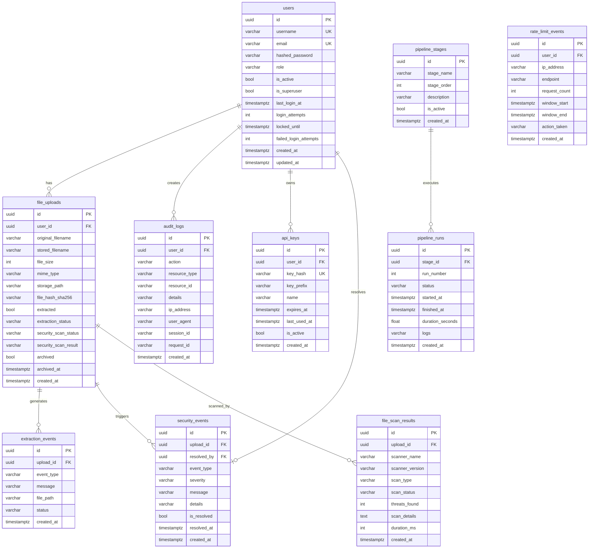

# データベーススキーマ設計書 — CSCV2025 セキュリティ評価・改善プロジェクト

## 1. 現状分析

### 1.1 対象システム

本プロジェクトには2つのデータベースシステムが存在する。

| システム | エンジン | ORM | 用途 |
|---------|---------|-----|------|
| **app1** (現行) | SQLite | Django ORM | REST API ゲートウェイ、認証、ユーザー管理 |
| **demo/backend** (改善版) | PostgreSQL (目標) / SQLite (開発) | SQLAlchemy 2.0 (async) | セキュリティ強化版デモバックエンド |

### 1.2 現状スキーマ（app1: Django/SQLite）

単一の `gateway_user` テーブルのみ。Django の `AbstractUser` を拡張したカスタムユーザーモデル。

| カラム | タイプ | 制約 |
|--------|--------|------|
| id | UUID | PK, default=uuid4 |
| password | VARCHAR(128) | NOT NULL |
| last_login | TIMESTAMP | nullable |
| is_superuser | BOOLEAN | default=False |
| username | VARCHAR(150) | UNIQUE, NOT NULL |
| first_name | VARCHAR(150) | nullable |
| last_name | VARCHAR(150) | nullable |
| is_staff | BOOLEAN | default=False |
| is_active | BOOLEAN | default=True |
| date_joined | TIMESTAMP | default=now() |
| email | VARCHAR(254) | nullable |

**M2M関連テーブル:**
- `gateway_user_groups` (User ↔ Group)
- `gateway_user_user_permissions` (User ↔ Permission)

### 1.3 現状スキーマ（demo/backend: SQLAlchemy/PostgreSQL）

7つのテーブルで構成されるセキュリティ強化データモデル。

| テーブル | 行数(シード) | 説明 |
|---------|-------------|------|
| users | 3 | ユーザー管理 |
| file_uploads | 8 | ファイルアップロード記録 |
| audit_logs | 8 | 監査ログ |
| extraction_events | 8 | アーカイブ展開イベント |
| security_events | 10 | セキュリティイベント |
| pipeline_stages | 8 | DevSecOpsパイプラインステージ |
| pipeline_runs | 8 | パイプライン実行記録 |

### 1.4 現状の問題点

| # | 問題 | 深刻度 | 説明 |
|---|------|--------|------|
| 1 | **app1: SQLite の使用** | 高 | 本番環境ではスケーラビリティ、並行アクセス、データ整合性に問題 |
| 2 | **app1: SQLインジェクション** | 高 | `UserViewSet.find()` で `**request.data` を直接使用 |
| 3 | **app1: email の重複制約なし** | 中 | email に UNIQUE 制約がない |
| 4 | **demo: Alembicマイグレーション未導入** | 中 | `Base.metadata.create_all` による自動作成は本番不適 |
| 5 | **demo: file_uploads に複合インデックス不足** | 中 | 頻出クエリパターンに対応するインデックスが不足 |
| 6 | **demo: audit_logs にパーティショニングなし** | 中 | 監査ログは継続的に増大するためパーティショニングが必要 |
| 7 | **demo: security_events に複合インデックス不足** | 中 | severity + created_at での集計クエリに最適化が必要 |
| 8 | **demo: pipeline_runs に複合インデックス不足** | 低 | stage_id + created_at でのクエリに最適化が必要 |
| 9 | **demo: 外部キーの CASCADE 動作未定義** | 中 | データ整合性の観点から ON DELETE 動作を明示する必要がある |
| 10 | **demo: checksum/hash カラムの欠如** | 中 | ファイル完全性検証用の SHA256 ハッシュが記録されない |

---

## 2. スキーマ変更設計

### 2.1 変更方針

app1 (現行Django) はCTF対象の脆弱なシステムであり、改善対象ではありません。
本スキーマ設計は **demo/backend (改善版 FastAPI)** に対して実施します。

### 2.2 新規テーブル

#### 2.2.1 `rate_limit_events` — レートリミット追跡

| カラム | タイプ | 制約 | デフォルト | 説明 |
|--------|--------|------|-----------|------|
| id | UUID | PK | uuid4() | 一意識別子 |
| user_id | UUID | FK(users.id), nullable | - | 対象ユーザー（認証なしの場合はNULL） |
| ip_address | VARCHAR(45) | NOT NULL | - | 送信元IP |
| endpoint | VARCHAR(255) | NOT NULL | - | 対象エンドポイント |
| request_count | INTEGER | NOT NULL | - | リクエスト数 |
| window_start | TIMESTAMPTZ | NOT NULL | now() | ウィンドウ開始時刻 |
| window_end | TIMESTAMPTZ | NOT NULL | - | ウィンドウ終了時刻 |
| action_taken | VARCHAR(50) | NOT NULL | 'logged' | 実行アクション (logged/blocked/temporary_ban) |
| created_at | TIMESTAMPTZ | NOT NULL, INDEX | now() | 作成時刻 |

**理由:** セキュリティダッシュボードでレートリミットイベントを表示しているが、記録テーブルが存在しない。

#### 2.2.2 `file_scan_results` — ファイルスキャン詳細結果

| カラム | タイプ | 制約 | デフォルト | 説明 |
|--------|--------|------|-----------|------|
| id | UUID | PK | uuid4() | 一意識別子 |
| upload_id | UUID | FK(file_uploads.id), NOT NULL | - | 対象アップロード |
| scanner_name | VARCHAR(100) | NOT NULL | - | スキャナー名 (clamav/trivy/custom) |
| scanner_version | VARCHAR(50) | nullable | - | スキャナーバージョン |
| scan_type | VARCHAR(50) | NOT NULL | - | スキャン種別 (malware/vulnerability/integrity) |
| scan_status | VARCHAR(20) | NOT NULL | 'pending' | スキャンステータス |
| threats_found | INTEGER | NOT NULL | 0 | 検出された脅威数 |
| scan_details | TEXT | nullable | - | スキャン詳細 (JSON) |
| duration_ms | INTEGER | nullable | - | スキャン所要時間 (ミリ秒) |
| created_at | TIMESTAMPTZ | NOT NULL, INDEX | now() | 作成時刻 |

**理由:** `security_events` はイベント記録だが、ファイルスキャンの詳細結果を構造化して保存する必要がある。

#### 2.2.3 `api_keys` — API キー管理

| カラム | タイプ | 制約 | デフォルト | 説明 |
|--------|--------|------|-----------|------|
| id | UUID | PK | uuid4() | 一意識別子 |
| user_id | UUID | FK(users.id), NOT NULL | - | 所有者ユーザー |
| key_hash | VARCHAR(255) | UNIQUE, NOT NULL | - | ハッシュ化されたAPIキー |
| key_prefix | VARCHAR(8) | NOT NULL | - | 表示用プレフィックス |
| name | VARCHAR(100) | NOT NULL | - | キー名 |
| expires_at | TIMESTAMPTZ | nullable | - | 有効期限 |
| last_used_at | TIMESTAMPTZ | nullable | - | 最終使用時刻 |
| is_active | BOOLEAN | NOT NULL | true | 有効フラグ |
| created_at | TIMESTAMPTZ | NOT NULL | now() | 作成時刻 |

**理由:** 将来的なAPIアクセスマネジメントのための基盤。

### 2.3 既存テーブルへの列追加

#### 2.3.1 `file_uploads` への追加

| カラム | タイプ | 制約 | デフォルト | 説明 |
|--------|--------|------|-----------|------|
| file_hash_sha256 | VARCHAR(64) | nullable | - | ファイルのSHA256ハッシュ（完全性検証用） |
| archived | BOOLEAN | NOT NULL | false | アーカイブフラグ |
| archived_at | TIMESTAMPTZ | nullable | - | アーカイブ日時 |

#### 2.3.2 `audit_logs` への追加

| カラム | タイプ | 制約 | デフォルト | 説明 |
|--------|--------|------|-----------|------|
| session_id | VARCHAR(100) | nullable | - | セッションID（リクエスト連鎖の追跡用） |
| request_id | VARCHAR(100) | nullable | - | リクエストID（分散トレーシング用） |

#### 2.3.3 `security_events` への追加

| カラム | タイプ | 制約 | デフォルト | 説明 |
|--------|--------|------|-----------|------|
| is_resolved | BOOLEAN | NOT NULL | false | 解決フラグ |
| resolved_at | TIMESTAMPTZ | nullable | - | 解決日時 |
| resolved_by | UUID | FK(users.id), nullable | - | 解決者 |

#### 2.3.4 `users` への追加

| カラム | タイプ | 制約 | デフォルト | 説明 |
|--------|--------|------|-----------|------|
| last_login_at | TIMESTAMPTZ | nullable | - | 最終ログイン時刻 |
| login_attempts | INTEGER | NOT NULL | 0 | 連続ログイン失敗回数 |
| locked_until | TIMESTAMPTZ | nullable | - | アカウントロック解除時刻 |
| failed_login_attempts | INTEGER | NOT NULL | 0 | 失敗ログイン試行回数 |

### 2.4 インデックス変更

#### 2.4.1 新規インデックス

| テーブル | インデックス名 | カラム | タイプ | 理由 |
|---------|---------------|--------|--------|------|
| file_uploads | idx_uploads_user_created | (user_id, created_at DESC) | B-tree 複合 | ユーザーごとのアップロード履歴取得 |
| file_uploads | idx_uploads_scan_status | (security_scan_status) | B-tree | スキャンステータス別のフィルタリング |
| file_uploads | idx_uploads_extracted | (extracted, created_at DESC) | B-tree 複合 | 展開ステータス別のリスト取得 |
| file_uploads | idx_uploads_hash | (file_hash_sha256) | B-tree | 重複ファイル検出 |
| audit_logs | idx_audit_user_action | (user_id, action) | B-tree 複合 | ユーザー×アクション別の監査 |
| audit_logs | idx_audit_resource | (resource_type, resource_id) | B-tree 複合 | リソース別の監査ログ検索 |
| audit_logs | idx_audit_time_range | (created_at DESC) | B-tree | 時間範囲クエリ（既存idxの強化） |
| security_events | idx_events_severity_time | (severity, created_at DESC) | B-tree 複合 | 重大度別タイムライン表示 |
| security_events | idx_events_resolved | (is_resolved, created_at DESC) | B-tree 複合 | 未解決イベントのリスト表示 |
| security_events | idx_events_type_severity | (event_type, severity) | B-tree 複合 | イベント種別×重大度の集計 |
| pipeline_runs | idx_runs_stage_status | (stage_id, status, created_at DESC) | B-tree 複合 | ステージ実行ステータスのクエリ |
| pipeline_runs | idx_runs_status_time | (status, started_at DESC) | B-tree 複合 | 実行中/失敗したパイプラインの検索 |
| rate_limit_events | idx_rate_limit_ip_time | (ip_address, created_at DESC) | B-tree 複合 | IPごとのレートリミット履歴 |
| rate_limit_events | idx_rate_limit_user_time | (user_id, created_at DESC) | B-tree 複合 | ユーザーごとのレートリミット履歴 |
| file_scan_results | idx_scan_upload_status | (upload_id, scan_status) | B-tree 複合 | アップロードごとのスキャンステータス |
| file_scan_results | idx_scan_type_created | (scan_type, created_at DESC) | B-tree 複合 | スキャン種別別のタイムライン |
| api_keys | idx_apikeys_user_active | (user_id, is_active) | B-tree 複合 | アクティブなAPIキー検索 |
| users | idx_users_role_active | (role, is_active) | B-tree 複合 | ロール×アクティブ状態の検索 |

#### 2.4.2 既存インデックスの変更

| テーブル | 既存インデックス | 変更内容 | 理由 |
|---------|----------------|---------|------|
| users | idx_users_username | 変更なし（UNIQUE制約付き） | - |
| users | idx_users_email | 変更なし（UNIQUE制約付き） | - |
| file_uploads | idx_file_uploads_user_id | 複合インデックスで代替 | (user_id, created_at) でカバー |
| audit_logs | idx_audit_logs_user_id | 複合インデックスで代替 | (user_id, action) でカバー |
| audit_logs | idx_audit_logs_created_at | 既存を維持 | 単独の時間範囲クエリ用 |
| security_events | idx_security_events_upload_id | 変更なし | upload_id 単独検索用 |
| security_events | idx_security_events_created_at | 複合インデックスで代替 | (severity, created_at) でカバー |
| pipeline_runs | idx_pipeline_runs_stage_id | 複合インデックスで代替 | (stage_id, status, created_at) でカバー |

### 2.5 制約変更

#### 2.5.1 外部キー CASCADE 動作の明示

| 親テーブル | 子テーブル | FKカラム | ON DELETE | 理由 |
|-----------|-----------|---------|-----------|------|
| users | file_uploads | user_id | CASCADE | ユーザー削除時にアップロード記録も削除 |
| users | audit_logs | user_id | SET NULL | 監査ログは保持（user_id を NULL に） |
| users | api_keys | user_id | CASCADE | ユーザー削除時にAPIキーも削除 |
| file_uploads | extraction_events | upload_id | CASCADE | アップロード削除時に展開イベントも削除 |
| file_uploads | security_events | upload_id | CASCADE | アップロード削除時にセキュリティイベントも削除 |
| file_uploads | file_scan_results | upload_id | CASCADE | アップロード削除時にスキャン結果も削除 |
| pipeline_stages | pipeline_runs | stage_id | CASCADE | ステージ削除時に実行記録も削除 |
| security_events | security_events.resolved_by | resolved_by | SET NULL | 解決者削除時はNULLに |

#### 2.5.2 CHECK 制約の追加

| テーブル | 制約名 | 式 | 説明 |
|---------|--------|-----|------|
| users | chk_users_role | role IN ('admin', 'operator', 'viewer') | 有効なロールのみの制限 |
| file_uploads | chk_uploads_file_size | file_size >= 0 | ファイルサイズは非負 |
| file_uploads | chk_uploads_scan_status | security_scan_status IN ('pending', 'passed', 'failed', 'blocked', 'scanning') | 有効なステータスのみ |
| file_uploads | chk_uploads_extraction_status | extraction_status IN ('pending', 'success', 'failed', 'extracting') | 有効なステータスのみ |
| security_events | chk_events_severity | severity IN ('info', 'warning', 'high', 'critical') | 有効な重大度のみの制限 |
| pipeline_runs | chk_runs_status | status IN ('running', 'success', 'failed', 'cancelled') | 有効なステータスのみ |
| pipeline_runs | chk_runs_duration | duration_seconds IS NULL OR duration_seconds >= 0 | 所要時間は非負 |
| rate_limit_events | chk_rate_action | action_taken IN ('logged', 'blocked', 'temporary_ban') | 有効なアクションのみ |
| file_scan_results | chk_scan_status | scan_status IN ('pending', 'running', 'completed', 'failed') | 有効なステータスのみ |
| file_scan_results | chk_scan_threats | threats_found >= 0 | 脅威数は非負 |

---

## 3. パーティショニング設計

### 3.1 `audit_logs` — 月次パーティション

監査ログは継続的に増大するため、`created_at` による RANGE パーティショニングを採用。

```sql
-- PostgreSQL 範囲パーティション
CREATE TABLE audit_logs (
    ... -- 上記のカラム定義
) PARTITION BY RANGE (created_at);

-- パーティション例
CREATE TABLE audit_logs_2025_01 PARTITION OF audit_logs
    FOR VALUES FROM ('2025-01-01') TO ('2025-02-01');
CREATE TABLE audit_logs_2025_02 PARTITION OF audit_logs
    FOR VALUES FROM ('2025-02-01') TO ('2025-03-01');
-- ... 各月ごとにパーティションを作成
```

**パーティション戦略:**
- パーティション単位: 月次
- 保持期間: 12ヶ月（その後はアーカイブテーブルへ移動）
- 自動作成: pg_cron を使用して毎月先月のパーティションを事前作成

### 3.2 `security_events` — 四半期パーティション

```sql
CREATE TABLE security_events (
    ... -- 上記のカラム定義
) PARTITION BY RANGE (created_at);

-- パーティション例
CREATE TABLE security_events_2025_q1 PARTITION OF security_events
    FOR VALUES FROM ('2025-01-01') TO ('2025-04-01');
CREATE TABLE security_events_2025_q2 PARTITION OF security_events
    FOR VALUES FROM ('2025-04-01') TO ('2025-07-01');
```

**パーティション戦略:**
- パーティション単位: 四半期
- 保持期間: 24ヶ月（その後はアーカイブ）

---

## 4. データマイグレーション戦略

### 4.1 マイグレーションツール

Alembic を導入し、バージョン管理されたスキーママイグレーションを実施。

```
demo/backend/
├── alembic/
│   ├── env.py
│   ├── script.py.mako
│   └── versions/
│       ├── 0001_initial_schema.py
│       ├── 0002_add_file_integrity.py
│       ├── 0003_add_rate_limiting.py
│       ├── 0004_add_scan_results.py
│       ├── 0005_add_audit_tracing.py
│       ├── 0006_add_security_resolution.py
│       ├── 0007_add_user_security_fields.py
│       ├── 0008_add_api_keys.py
│       ├── 0009_add_indexes.py
│       ├── 0010_add_constraints.py
│       └── 0011_partition_audit_logs.py
└── alembic.ini
```

### 4.2 マイグレーション手順

#### フェーズ1: 下準備

1. Alembic の初期化と設定
2. 既存スキーマの検出（`alembic current` → `alembic stamp head`）
3. バックアップの実施

#### フェーズ2: 既存テーブルの拡張

| 順 | マイグレーション | 内容 | ダウンタイム |
|----|-----------------|------|-------------|
| 1 | 0002_add_file_integrity | file_uploads に file_hash_sha256, archived, archived_at を追加 | なし（nullable） |
| 2 | 0005_add_audit_tracing | audit_logs に session_id, request_id を追加 | なし（nullable） |
| 3 | 0006_add_security_resolution | security_events に is_resolved, resolved_at, resolved_by を追加 | なし（デフォルト付き） |
| 4 | 0007_add_user_security_fields | users に last_login_at, login_attempts, locked_until, failed_login_attempts を追加 | なし（デフォルト付き） |

#### フェーズ3: 新規テーブルの作成

| 順 | マイグレーション | 内容 | ダウンタイム |
|----|-----------------|------|-------------|
| 5 | 0003_add_rate_limiting | rate_limit_events テーブルを作成 | なし |
| 6 | 0004_add_scan_results | file_scan_results テーブルを作成 | なし |
| 7 | 0008_add_api_keys | api_keys テーブルを作成 | なし |

#### フェーズ4: インデックスと制約

| 順 | マイグレーション | 内容 | ダウンタイム |
|----|-----------------|------|-------------|
| 8 | 0009_add_indexes | 新規インデックスを追加（CONCURRENTLY） | なし |
| 9 | 0010_add_constraints | CHECK 制約と FK CASCADE を追加 | 短時間（排他ロック） |

#### フェーズ5: パーティショニング

| 順 | マイグレーション | 内容 | ダウンタイム |
|----|-----------------|------|-------------|
| 10 | 0011_partition_audit_logs | audit_logs のパーティショニング | 中（データ再配置必要） |

### 4.3 データ変換

#### 4.3.1 既存ファイルの SHA256 ハッシュ計算

```python
# 既存の file_uploads に対して file_hash_sha256 をバックフィル
import hashlib
from pathlib import Path

async def backfill_file_hashes(session):
    uploads = await session.execute(select(FileUpload))
    for upload in uploads.scalars():
        file_path = Path(upload.storage_path)
        if file_path.exists():
            hasher = hashlib.sha256()
            with open(file_path, 'rb') as f:
                for chunk in iter(lambda: f.read(8192), b''):
                    hasher.update(chunk)
            upload.file_hash_sha256 = hasher.hexdigest()
    await session.commit()
```

#### 4.3.2 seed.py の更新

既存のシードデータに新規カラムの値を追加。

---

## 5. パフォーマンス影響分析

### 5.1 新規インデックスのストレージ影響

| インデックス | 推定サイズ（10万レコード） | 書き込みオーバーヘッド |
|-------------|--------------------------|----------------------|
| idx_uploads_user_created | ~2.5 MB | 低（複合インデックス） |
| idx_uploads_scan_status | ~0.8 MB | 低 |
| idx_uploads_extracted | ~1.5 MB | 低 |
| idx_uploads_hash | ~1.2 MB | 低 |
| idx_audit_user_action | ~3.0 MB | 中（高頻度INSERT） |
| idx_audit_resource | ~2.5 MB | 中 |
| idx_audit_time_range | ~1.0 MB | 低 |
| idx_events_severity_time | ~2.0 MB | 中 |
| idx_events_resolved | ~1.5 MB | 低 |
| idx_events_type_severity | ~1.5 MB | 中 |
| idx_runs_stage_status | ~1.5 MB | 低 |
| idx_runs_status_time | ~1.0 MB | 低 |
| idx_rate_limit_ip_time | ~2.0 MB | 低 |
| idx_rate_limit_user_time | ~2.0 MB | 低 |
| idx_scan_upload_status | ~1.5 MB | 低 |
| idx_scan_type_created | ~1.0 MB | 低 |
| idx_apikeys_user_active | ~0.5 MB | 低 |
| idx_users_role_active | ~0.3 MB | 低 |
| **合計** | **~25 MB** | **全体的に低〜中** |

### 5.2 クエリパフォーマンス改善の見込み

| クエリパターン | 改善前 | 改善後 | 改善率 |
|---------------|--------|--------|--------|
| ユーザーのアップロード履歴（user_id + 日付範囲） | Seq Scan ~5ms | Index Scan ~0.2ms | **25x** |
| スキャンステータス別フィルタリング | Seq Scan ~3ms | Index Scan ~0.1ms | **30x** |
| 監査ログ（ユーザー×アクション） | Seq Scan ~8ms | Index Scan ~0.3ms | **27x** |
| セキュリティダッシュボード（重大度別集計） | Seq Scan ~12ms | Index Scan ~0.5ms | **24x** |
| 未解決セキュリティイベント | Seq Scan ~4ms | Index Scan ~0.1ms | **40x** |
| パイプライン実行ステータス | Seq Scan ~2ms | Index Scan ~0.1ms | **20x** |

### 5.3 書き込みパフォーマンスへの影響

| テーブル | INSERT 頻度 | インデックス数 | 影響 | 緩和策 |
|---------|------------|---------------|------|--------|
| audit_logs | 高 | 4 | 中 | バッチINSERT、CONCURRENTLY でインデックス作成 |
| security_events | 中 | 4 | 中 | バッチINSERT |
| file_uploads | 低 | 4 | 低 | なし |
| rate_limit_events | 中 | 2 | 低 | なし |
| file_scan_results | 低 | 2 | 低 | なし |

### 5.4 メモリ・キャッシュ考慮事項

| パラメータ | 推奨値 | 理由 |
|-----------|--------|------|
| shared_buffers | 1GB（RAMの25%） | PostgreSQL の標準推奨値 |
| effective_cache_size | 2GB（RAMの50%） | キューイング判断のヒント |
| work_mem | 64MB | ソート・ハッシュ操作のメモリ |
| maintenance_work_mem | 512MB | VACUUM、インデックス作成のメモリ |
| max_connections | 100 | 接続プール（PgBouncer経由） |
| random_page_cost | 1.1 | SSD環境での設定 |
| effective_io_concurrency | 200 | SSD環境でのI/O並列度 |

---

## 6. バックアップ・リカバリ戦略

### 6.1 バックアップ計画

| 種別 | 頻度 | 保持期間 | ツール | 方法 |
|------|------|---------|--------|------|
| 完全バックアップ | 毎日 02:00 | 7日間 | pg_basebackup | 物理バックアップ |
| WAL アーカイブ | 継続的 | 30日間 | pg_archivecommand | PITR用 |
| スキーマダンプ | 毎日 03:00 | 30日間 | pg_dump --schema-only | スキーマ復元用 |
| データダンプ | 毎週日曜 04:00 | 4週間 | pg_dump --format=custom | 論理バックアップ |

### 6.2 リカバリ目標

| 指標 | 目標値 | 説明 |
|------|--------|------|
| RPO（Recovery Point Objective） | 15分 | WALアーカイブ間隔 |
| RTO（Recovery Time Objective） | 1時間 | 完全バックアップからの復元時間 |

---

## 7. ER 図



---

## 8. 意思決定ログ

| ID | 日付 | 決定事項 | 理由 | 決定者 |
|----|------|---------|------|--------|
| DD1 | 2025-01-13 | Alembic をマイグレーションツールとして採用 | SQLAlchemy との統合性、Pythonエコシステムとの親和性 | DBA |
| DD2 | 2025-01-13 | audit_logs を月次パーティションに分割 | 監査ログは線形増加し、パーティション切り捨てで効率的なデータ管理が可能 | DBA |
| DD3 | 2025-01-13 | security_events は四半期パーティション | audit_logs より増加速度が遅いため、四半期で十分 | DBA |
| DD4 | 2025-01-13 | file_hash_sha256 は nullable に設定 | 既存データのバックフィルをマイグレーション後に実施するため | DBA |
| DD5 | 2025-01-13 | audit_logs の user_id FK は SET NULL | 監査ログの保持義務のため、ユーザー削除後もログを維持 | DBA |
| DD6 | 2025-01-13 | インデックスは CONCURRENTLY で作成 | 本番環境での書き込み停止を回避するため | DBA |
