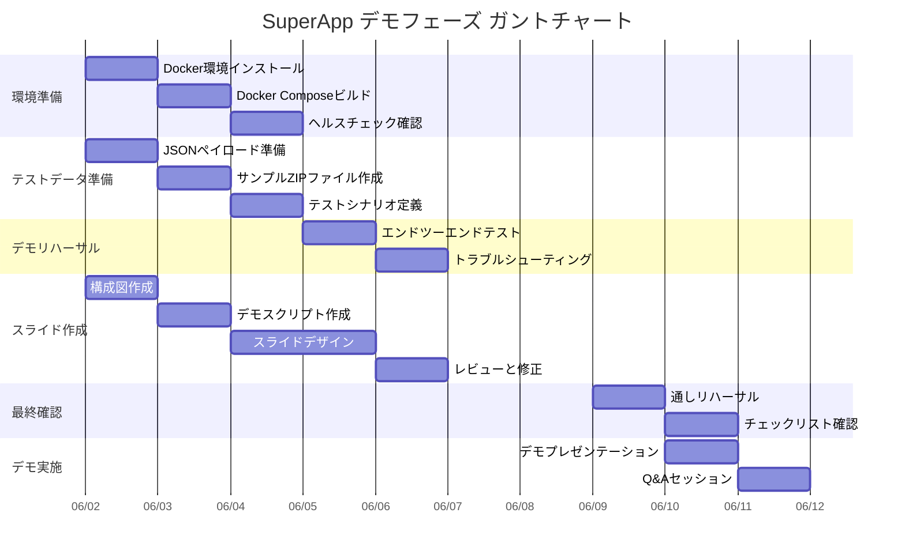

# 提案書：SuperApp デモフェーズ

## 1. 概要

本提案書は、SuperAppプロジェクトのデモフェーズにおける範囲定義、実施アプローチ、スケジュール、およびチーム構成に関するものです。SuperAppはDjangoベースのREST APIゲートウェイ（App1）とPHP/Apacheベースのストレージサービス（App2）からなる2マイクロサービスアーキテクチャであり、Docker Composeによるコンテナ化デプロイメントを採用しています。

### 1.1 プロジェクト背景

SuperAppは以下のコア機能を有するWebアプリケーションです：

- **ユーザー認証・管理**：JWTベース認証（djangorestframework-simplejwt）、ユーザー登録・検索機能
- **ファイルアップロード・処理**：ZIPファイル検証（許可拡張子チェック）、7zアーカイブ解凍処理
- **サービスヘルスチェック**：モジュール別死活監視

### 1.2 デモの目的

- 開発ステークホルダーに対してシステムアーキテクチャとコア機能の実証
- ファイルアップロードからストレージサービスへのエンドツーエンドデータフローの検証
- コンテナ化環境でのサービス連携動作の確認
- セキュリティ設計（ファイル検証、認証ガード）のデモンストレーション

---

## 2. 業務範囲

### 2.1 スコープ内

| No. | 項目 | 説明 |
|-----|------|------|
| 1 | デモ環境構築 | Docker Composeによるローカル実行環境の準備と動作確認 |
| 2 | App1 ゲートウェイデモ | ユーザー登録、JWT認証、ファイルアップロードAPI、ヘルスチェックAPI |
| 3 | App2 ストレージデモ | ファイル受領、7z解凍処理、ストレージディレクトリ管理 |
| 4 | サービス連携フロー | App1→App2間のファイルトランスポートエンドツーエンド |
| 5 | デモスライド作成 | 構成図、アーキテクチャ図、ユーザージャーニー、デモフロー |
| 6 | デモ用テストデータ準備 | テストユーザー、サンプルZIPファイル、ヘルスチェックシナリオ |

### 2.2 スコープ外

| No. | 項目 | 理由 |
|-----|------|------|
| 1 | 本番環境デプロイメント | デモフェーズではローカルコンテナ環境のみ対象 |
| 2 | フロントエンドUI開発 | APIレベルでのデモンストレーションに限定 |
| 3 | パフォーマンステスト | 機能検証が主目的。負荷テストは後工程 |
| 4 | セキュリティ監査 | CTFコンテキストを踏まえた設計理解は行うが、正式な脆弱性評価は対象外 |
| 5 | データベース移行（SQLite→PostgreSQL） | 既存設計の維持 |

---

## 2.3 作業分解構造（WBS）

### 1. 環境準備
#### 1.1 Docker環境のインストールと設定 — Est: 0.5日 — Owner: Dev Lead
#### 1.2 Docker Composeビルドと起動テスト — Est: 1日 — Owner: Dev Lead
#### 1.3 両サービスのヘルスチェック確認 — Est: 0.5日 — Owner: Dev Lead

### 2. テストデータ準備
#### 2.1 テストユーザー作成用JSONペイロード準備 — Est: 0.5日 — Owner: Dev Team
#### 2.2 サンプルZIPファイル作成（許可拡張子のみ） — Est: 0.5日 — Owner: Dev Team
#### 2.3 テスト用シナリオ定義 — Est: 1日 — Owner: Dev Team

### 3. デモリハーサル
#### 3.1 エンドツーエンドフローテスト — Est: 1日 — Owner: Dev Lead
#### 3.2 トラブルシューティングと改善 — Est: 1日 — Owner: Dev Lead

### 4. スライド作成
#### 4.1 構成図とアーキテクチャ図作成 — Est: 1日 — Owner: PM
#### 4.2 デモスクリプトとナレーション作成 — Est: 1日 — Owner: PM
#### 4.3 スライドデザインとレイアウト — Est: 2日 — Owner: PM
#### 4.4 レビューと修正 — Est: 1日 — Owner: PM

### 5. 最終確認
#### 5.1 全チーム通しリハーサル — Est: 0.5日 — Owner: PM + Dev Lead
#### 5.2 最終チェックリスト確認 — Est: 0.5日 — Owner: PM

### 6. デモ実施
#### 6.1 デモプレゼンテーション — Est: 0.5日 — Owner: PM + Dev Lead
#### 6.2 Q&Aセッション — Est: 0.5日 — Owner: PM + Dev Lead

---

## 2.4 ガントチャート



---

## 3. アプローチ

### 3.1 デモ手法

1. **アーキテクチャ説明**：2サービス構成、Docker Composeネットワーク、データフロー
2. **ライブデモ**：実際のAPI呼び出しによるエンドツーエンド動作確認
3. **スライドプレゼンテーション**：システム設計、技術選定理由、今後のロードマップ

### 3.2 技術スタック

| レイヤ | 技術 | 役割 |
|--------|------|------|
| App1（ゲートウェイ） | Django 5.2 + DRF + uWSGI | REST API、認証、ファイル検証 |
| App2（ストレージ） | PHP/Apache + Archive7z | ファイル受領・7z解凍 |
| データベース | SQLite3（Django内蔵） | ユーザーデータ保存 |
| コンテナ | Docker Compose | サービス编排・ネットワーク |
| 認証 | JWT（SimpleJWT） | トークンベース認証 |

### 3.3 デモフロー

```
1. 環境起動（docker compose up）
2. ヘルスチェック確認（GET /gateway/health/?module=/health.php → "OK"）
3. ユーザー登録（POST /gateway/user/ → username文字列）
4. トークン取得（POST /auth/token/ → {access, refresh}）
5. ファイルアップロード（POST /gateway/transport/ → "OK"）
6. ストレージ確認（App2側 storage/<user-id>/ 内の解凍結果）
7. ユーザー検索（POST /gateway/user/find/?offset=0 → ユーザーリスト）
8. 環境停止（docker compose down）
```

---

## 4. タイムライン

### 4.1 プロジェクトスケジュール

| フェーズ | 開始 | 終了 | 期間 | 依存関係 | 責任者 |
|---------|------|------|------|---------|--------|
| フェーズ1：環境準備 | 2025-06-02 | 2025-06-03 | 2日 | - | Dev Lead |
| フェーズ2：テストデータ準備 | 2025-06-02 | 2025-06-04 | 3日 | フェーズ1 | Dev Team |
| フェーズ3：デモリハーサル | 2025-06-05 | 2025-06-06 | 2日 | フェーズ1, 2 | Dev Lead |
| フェーズ4：スライド作成 | 2025-06-02 | 2025-06-07 | 6日 | - | PM |
| フェーズ5：最終確認 | 2025-06-09 | 2025-06-09 | 1日 | フェーズ3, 4 | PM + Dev Lead |
| フェーズ6：デモ実施 | 2025-06-10 | 2025-06-10 | 1日 | フェーズ5 | PM + Dev Lead |

### 4.2 マイルストーン

| マイルストーン | ターゲット日 | 完了基準 |
|---------------|-------------|---------|
| M1：環境動作確認完了 | 2025-06-03 | Docker Compose起動、両サービスヘルスOK |
| M2：エンドツーエンドテスト成功 | 2025-06-05 | ファイルアップロード→解凍の全フロー確認 |
| M3：スライド完成 | 2025-06-07 | 構成図、フロー図、デモスクリプト完成 |
| M4：最終リハーサル完了 | 2025-06-09 | 全チームでの通し演習完了 |
| M5：デモ実施 | 2025-06-10 | ステークホルダーへのデモ完了 |

---

## 5. チーム構成

### 5.1 RACIマトリクス

| 活動 | PM | Dev Lead | Dev Team | QA | ステークホルダー |
|------|:--:|:--------:|:--------:|:--:|:----------------:|
| 環境構築 | A | R | C | I | I |
| テストデータ準備 | A | R | R | C | I |
| デモスクリプト作成 | A | R | C | I | C |
| スライド作成 | R | C | I | I | C |
| リハーサル実施 | A | R | R | C | I |
| デモ実施 | R | R | C | I | I |
| フィードバック収集 | R | C | I | I | R |

*R=責任者(Responsible), A=担当事者(Accountable), C=協議者(Consulted), I=情報共有(Informed)*

### 5.2 役割分担

| ロール | 担当 | 主な責任 |
|--------|------|---------|
| PM（プロジェクトマネージャー） | PM | スケジュール管理、ステークホルダー調整、ドキュメント作成 |
| Dev Lead（開発リード） | Dev Lead | 環境構築、デモ技術責任、トラブルシューティング |
| Dev Team（開発チーム） | Dev Team | テストデータ準備、APIテスト、障害修正 |
| QA（品質保証） | QA | テストケースレビュー、デモ動作検証 |
| ステークホルダー | Stakeholder | 要件確認、デモ参加、フィードバック提供 |

---

## 6. リスク管理

### 6.1 リスクレジスター

| ID | リスク | 発生確率 | 影響度 | スコア | 軽減策 | 責任者 | ステータス |
|----|--------|---------|--------|-------|--------|--------|-----------|
| R1 | Docker Compose環境の起動失敗 | 中 | 高 | 高 | 事前に複数回起動テスト、代替環境の準備 | Dev Lead | Open |
| R2 | ファイルアップロードのタイムアウト | 低 | 中 | 中 | タイムアウト値の調整、小サイズテストファイル使用 | Dev Lead | Open |
| R3 | JWT認証トークンの期限切れ | 中 | 中 | 中 | デモ前にトークン再発行、リフレッシュフロー準備 | Dev Team | Open |
| R4 | 7z解凍処理の失敗（不正ファイル） | 低 | 中 | 低 | バリデーション済みテストファイルのみ使用 | Dev Team | Open |
| R5 | デモ当日のネットワーク障害 | 低 | 高 | 中 | ローカル環境実行、オフライン対応準備 | Dev Lead | Open |
| R6 | ステークホルダーのスケジュール調整困難 | 中 | 高 | 高 | 候補日程を複数提示、録画対応準備 | PM | Open |
| R7 | App2のPHPサービス応答遅延 | 中 | 中 | 中 | ヘルスチェックで事前確認、リトライロジック準備 | Dev Lead | Open |

---

## 7. 成功基準

| No. | 成功基準 | 測定方法 |
|-----|---------|---------|
| 1 | Docker Compose環境の正常起動 | 両サービスヘルスチェックOK |
| 2 | ユーザー登録→認証→ファイルアップロードの全フロー完了 | エンドツーエンドテストケースパス |
| 3 | App2での7z解凍結果の確認 | ストレージディレクトリのファイル存在確認 |
| 4 | ステークホルダーの満足度 | デモ後のフィードバック調査 |
| 5 | デモ時間の遵守 | 予定時間内（±10%）の完了 |

---

## 8. 仮定条件

1. DockerおよびDocker Composeが実行環境にインストールされている
2. ローカルネットワークが安定している
3. テスト用ZIPファイルは許可拡張子（.txt, .docx, .png, .jpg, .jpeg）のみを含む
4. デモはローカルコンテナ環境で行う（外部ネットワーク接続不要）
5. SQLite3データベースでデモ規模のデータ処理は十分に対応可能

---

## 9. 前提制約

1. 既存のコードベースを変更しない（デモ目的でのみ使用）
2. フロントエンドUIは提供されない（APIレベルでのデモンストレーション）
3. データベースはSQLite3を使用（変更不可）
4. CTFコンテキストを考慮したセキュリティ設計は既存のまま維持
5. デモ期間は2025-06-02から2025-06-10まで

---

## 10. 承認

| 役割 | 氏名 | 日付 | 署名 |
|------|------|------|------|
| PM | | | |
| Dev Lead | | | |
| ステークホルダー | | | |
